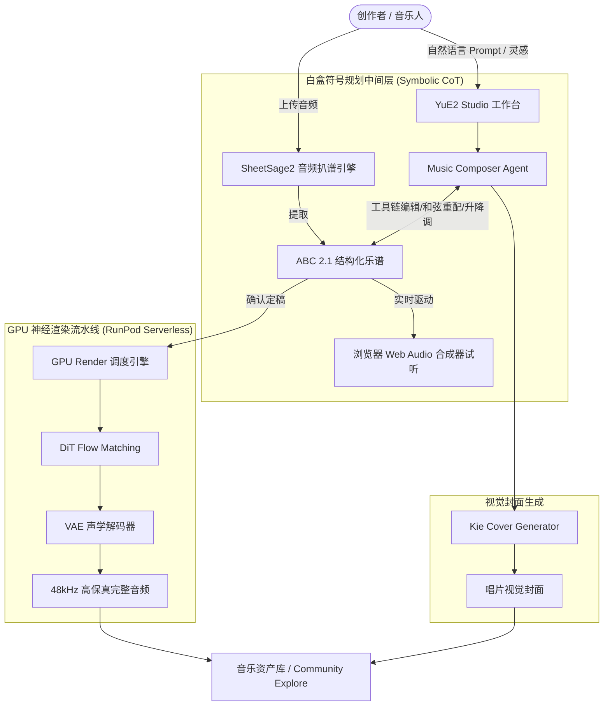

# 🎵 YuE2 Music (YuE 2.0 白盒音乐大模型创作平台)

[](https://tanstack.com/start)
[](https://developers.cloudflare.com/workers/)
[](https://github.com/multimodal-art-projection/YuE)
[](https://orm.drizzle.team/)
[](LICENSE)

**YuE2 Music** 是基于 M·A·P（Multimodal Art Projection 多模态艺术投影）团队推出的开源前沿音乐基座模型 **YuE 2.0** 构建的全栈白盒 AI 音乐创作平台与 SaaS 系统。

与传统黑盒 AI 音乐生成器（如 Suno、Udio 等“输入提示词直接黑盒输出音频”）不同，YuE2 Music 引入了**思维链符号规划 (Symbolic CoT Planning)**。系统将结构化 **ABC 记谱法 (ABC 2.1 Notation)** 作为白盒中间表征，支持人类音乐家或内置 AI Agent 进行和弦重配、转调、曲式改写，并在浏览器中实现零 GPU 延迟的 Web Audio 实时合成试听，最后交由高性能神经音频扩散流水线渲染输出 48kHz 高保真立体声全曲。

---

## 🌟 核心特性

### 1. 🎼 白盒符号规划与透明可控创作 (White-Box Symbolic Planning)
- **拒绝黑盒抽卡**：模型先规划出明文可读的 ABC 乐谱，包含调性、拍号、速度、和弦走势与分轨旋律。
- **灵活干预与二次编曲**：支持半音阶升降调（Transpose）、八度位移、和弦替换（如流行转爵士七和弦、五声重配、伤感小调重配等）。
- **专业乐谱校验引擎**：内置 ABC 语法自动诊断与容错修复，确保生成的乐谱符合音乐学规范。

### 2. 🎹 交互式编曲工作台 (YuE2 Studio)
- **实时五线/简谱渲染**：集成 `abcjs`，动态渲染标准乐谱视图，支持小节高亮和缩放。
- **浏览器实时音频合成器 (Web Audio Synth)**：在无需等待昂贵 GPU 渲染前，直接在浏览器端实时回放旋律与和弦进行，秒级试听作曲效果。
- **结构化歌词与分段编排**：直观编辑 `[Intro]`、`[Verse]`、`[Chorus]`、`[Bridge]`、`[Outro]`，精准控制人声演唱结构。
- **AI 唱片封面设计**：根据歌曲流派、歌词意境自动生成 Prompt 并调用生图服务生成 4K 专辑封面。

### 3. 🤖 对话式 AI 作曲助手机器人 (Music Composer Agent)
- **自然语言多轮交互**：只需说出需求（如“把副歌改成更激昂的爵士和弦，升一个全音”），Agent 自动解析并调用工具执行编曲修改。
- **丰富的内置 Toolchain**：
  - `transpose`: 精准升降调
  - `reharmonize_jazz / pop / sad_minor`: 风格化和弦重配
  - `change_tempo / change_meter`: 节拍与速度调整
  - `render_audio`: 确认定稿后一键提交 GPU 全曲渲染任务

### 4. 🎧 音频转谱与逆向分析套件 (Audio-to-Score & SheetSage2)
- **Audio to Score** (`/audio-to-score`)：上传任意歌曲录音，自动逆向转录为 ABC 乐谱。
- **Audio to MIDI** (`/audio-to-midi`, `/mp3-to-midi`)：一键提取旋律与伴奏分轨 MIDI，无缝导入 Logic Pro、Ableton Live、FL Studio。
- **Audio to MusicXML** (`/audio-to-musicxml`)：导出标准五线谱 XML 格式，导入 MuseScore / Sibelius / Finale。
- **Audio to Lead Sheet** (`/audio-to-lead-sheet`)：生成旋律和弦总谱 Lead Sheet。
- **Suno 版权与创作指纹固化** (`/suno-copyright`, `/suno-midi-export`)：将 Suno 生成的音频提取 MIDI 与乐谱，形成确凿原创版权链路。

### 5. ⚡ 神经音频扩散流水线 (Neural Audio Rendering)
- **RunPod Serverless 算力集群集成**：连接 GPU Worker 节点，通过流式状态机跟踪任务：
  `QUEUED` ➔ `SYMBOLIC_PLANNING` ➔ `DIT_FLOW_MATCHING` ➔ `VAE_DECODING` ➔ `COMPLETED`
- **48kHz 双声道立体声母带级输出**：端到端输出广播级人声与真实声学伴奏。

### 6. 🌍 6 国语言全量本地化 (i18n)
- 基于 Paraglide JS 构建，支持无缝切换与 locale 路由：
  - 🇨🇳 简体中文 (`zh`)
  - 🇺🇸 英语 (`en`)
  - 🇷🇺 俄语 (`ru`)
  - 🇪🇸 西班牙语 (`es`)
  - 🇧🇷 葡萄牙语 (`pt`)
  - 🇩🇪 德语 (`de`)

### 7. 💼 企业级 SaaS 基础设施与商业化闭环
- **用户鉴权**：Better-Auth 支持邮箱验证码、账号密码与 OAuth。
- **积分系统 (Credits Engine)**：FIFO 先进先出扣费逻辑，生成失败自动原路退款，注册新用户赠礼。
- **支付网关**：集成 Waffo Pancake 支付通道，支持多种充值卡包（Creator Pass、Pro Musician、Studio Master）。
- **后台管理 (Admin Portal)**：RBAC 权限管理、订单对账、AI 生成任务审计与数据分析看板。

---

## 📐 系统架构与流程



---

## 🛠️ 技术栈

| 领域 | 选用技术 / 依赖 |
| :--- | :--- |
| **应用框架** | [TanStack Start](https://tanstack.com/start) (React 19 + TypeScript) |
| **构建与引擎** | Vite 8 + Nitro Server Engine |
| **边缘部署** | Cloudflare Workers / Nitro Cloudflare Preset |
| **样式与动效** | Tailwind CSS 4, Motion (Framer Motion), Lucide Icons |
| **乐谱与音频** | `abcjs` (SVG 乐谱渲染 & 浏览器音频合成), Web Audio API |
| **数据持久化** | [Drizzle ORM](https://orm.drizzle.team/), 支持 SQLite (本地) / Cloudflare D1 (生产) / PostgreSQL / MySQL |
| **用户认证** | [Better-Auth](https://better-auth.com/) (Session, JWT, OAuth) |
| **支付网关** | Waffo Pancake Payment Gateway |
| **国际化 (i18n)** | `@inlang/paraglide-js` (编译期无损多语言) |
| **AI 算力后端** | RunPod Serverless (YuE2 3B/7B DiT 推理), SheetSage2 Docker Worker |

---

## 📂 目录结构

```text
apps/yue2music/
├── d1-migrations/          # Cloudflare D1 生产数据库迁移脚本
├── data/                   # 本地 SQLite 开发数据库 (local.db)
├── messages/               # 多语言词条源文件 (en, zh, ru, es, pt, de)
├── public/                 # 静态资源 (音频示例、封面图、图标)
├── scripts/                # 运维与诊断脚本 (RBAC初始化、Agent多轮测试、环境包裹器)
│   ├── init-rbac.ts        # 初始化超级管理员角色与权限
│   ├── test-agent.ts       # Agent 编曲与 ABC 校验单元测试
│   └── with-env.ts         # 环境变量注入执行器
├── serverless/             # 独立 GPU/AI 微服务代码
│   └── sheetsage2/         # SheetSage2 深度学习音频转乐谱 Worker (Dockerfile, handler.py)
├── src/
│   ├── components/         # 页面功能组件 (ShowcaseGallery, TranscribeModal 等)
│   ├── config/             # 数据库 schema、应用配置与环境变量
│   ├── core/               # 核心业务底座 (auth, db, i18n, storage)
│   ├── lib/
│   │   └── yue2/           # YuE2 核心逻辑库
│   │       ├── agent.ts    # 作曲家 Agent 对话引擎与 Toolchain
│   │       ├── composer.ts # 乐谱合成与编曲处理
│   │       ├── editor.ts   # 乐谱升降调、和弦重配、结构改写算法
│   │       ├── presets.ts  # 多流派预设曲目库 (1100+ 行专业 ABC 曲目)
│   │       ├── runpod.ts   # RunPod GPU 渲染任务提交与状态轮询
│   │       ├── sheetsage.ts# SheetSage 转谱服务调用客户端
│   │       ├── synth.ts    # 浏览器 Web Audio 合成器
│   │       ├── validator.ts# ABC 语法与小节完整性校验
│   │       └── worker.ts   # 渲染任务状态机与后台调度
│   ├── market/             # 市场元信息、定价策略、SEO FAQs、多语言展示配置
│   ├── modules/            # SaaS 业务模块 (credits, payment, etc.)
│   └── routes/             # TanStack Start 文件式路由
│       ├── (auth)/         # 登录注册页面
│       ├── api/            # 接口路由 (Agent 对话, 音频渲染, 支付回调等)
│       ├── studio.tsx      # YuE2 Studio 主工作台
│       ├── audio-to-score.tsx # 音频转乐谱工具
│       ├── audio-to-midi.tsx  # 音频转 MIDI 工具
│       ├── explore.tsx     # 社区探索与灵感广场
│       ├── library.tsx     # 个人作品与收藏库
│       └── index.tsx       # 官网首页与特性展示
├── drizzle.config.ts       # Drizzle ORM 配置文件
├── package.json            # 项目依赖与执行脚本
├── vite.config.ts          # Vite & Nitro 打包配置
└── wrangler.jsonc          # Cloudflare Workers 部署描述文件
```

---

## 🚀 快速上手

### 1. 环境准备
- **Node.js**: >= 20.0.0
- **包管理器**: [pnpm](https://pnpm.io/) >= 9.0.0

### 2. 安装依赖
在仓库根目录或 `apps/yue2music` 目录下执行：

```bash
pnpm install
```

### 3. 配置环境变量
复制环境变量模板：

```bash
cp .env.example .env.local
```

修改 `.env.local` 填入必要配置：

```env
# 基础运行配置
VITE_APP_URL=http://localhost:3000
VITE_MARKET_ID=yue2music
DATABASE_PROVIDER=sqlite
DATABASE_URL=file:data/local.db
AUTH_SECRET=your-secure-auth-secret-here
CONFIG_ENCRYPTION_KEY=your-32-char-encryption-key
INITIAL_CREDITS_AMOUNT=50

# Waffo 支付网关配置 (如需启用支付)
WAFFO_ENABLED=true
WAFFO_MERCHANT_ID=MER_xxxxxxxx
WAFFO_STORE_ID=STO_xxxxxxxx
WAFFO_ENVIRONMENT=test
WAFFO_PRIVATE_KEY=your-waffo-private-key

# GPU 算力集群配置 (RunPod Serverless)
RUNPOD_API_KEY=your-runpod-api-key
RUNPOD_ENDPOINT_ID=your-yue2-endpoint-id

# SheetSage2 扒谱算力端点
RUNPOD_SHEETSAGE_API_KEY=your-sheetsage-runpod-key
RUNPOD_SHEETSAGE_ENDPOINT_ID=your-sheetsage-endpoint-id
```

### 4. 数据库初始化
初始化本地 SQLite 数据库并推送表结构：

```bash
pnpm db:setup
pnpm db:push
```

初始化超级管理员账号及 RBAC 角色系统：

```bash
pnpm rbac:init --admin-email=admin@example.com --admin-password=YourStrongPassword
```

### 5. 启动开发服务器

```bash
pnpm dev
```

浏览器访问 `http://localhost:3000` 即可进入 YuE2 Music 平台。

---

## 🧪 测试与验证

项目内置了针对 ABC 语法校验、和弦重配算法以及 Agent 作曲对话的多维度验证测试：

```bash
# 运行 Agent 与乐谱算法单元测试
pnpm test

# 运行 TypeScript 类型检查
pnpm typecheck

# 检查代码格式与市场配置规范
pnpm lint
```

---

## 🚢 生产部署

### 部署到 Cloudflare Workers

1. **构建生产包**：
   ```bash
   pnpm cf:build
   ```

2. **推送 D1 数据库架构**：
   在首次部署时，将本地 SQL 结构应用到远程 Cloudflare D1：
   ```bash
   wrangler d1 execute yue2music-db --remote --file=./d1-migrations/schema.sql
   ```

3. **设置 Cloudflare 生产机密 (Secrets)**：
   ```bash
   wrangler secret put AUTH_SECRET
   wrangler secret put CONFIG_ENCRYPTION_KEY
   wrangler secret put RUNPOD_API_KEY
   wrangler secret put RUNPOD_ENDPOINT_ID
   wrangler secret put WAFFO_PRIVATE_KEY
   ```

4. **一键部署**：
   ```bash
   pnpm cf:deploy
   ```

---

## 🎼 ABC 记谱法示例

YuE2 系统所使用的白盒中间乐谱规范如下：

```abc
X:1
T:Midnight Blue Jazz
M:4/4
L:1/8
Q:1/4=108
K:F
%%style jazz ballad, warm muted trumpet, walking bass, soulful female vocal
[V:1] "Fmaj7" A2 c2 "Am7" e4 | "Dm7" d2 f2 "G7" g4 | "Gm7" B2 d2 "C7" c4 | "Fmaj7" F8 |]
w: Under the ci-ty lights, we drift a-way to-night.
```

- `M:` 拍号（Time Signature）
- `L:` 基本音长（Unit Note Length）
- `Q:` 速度（Tempo / BPM）
- `K:` 调性（Key Signature）
- `"Fmaj7"`: 和弦记号，用于驱动伴奏生成与和声指导
- `w:` 歌词对位绑定

---

## 📄 开源许可与致谢

- 本项目基于 MIT 许可证开源。
- 感谢 **M·A·P (Multimodal Art Projection)** 团队研发并开源的 [YuE / YuE 2.0](https://github.com/multimodal-art-projection/YuE) 基础大模型。
- 感谢 [SheetSage](https://github.com/chrisdonahue/sheetsage) 提供的音乐转录理论与音频逆向支持。
- 感谢 [abcjs](https://github.com/paulrosen/abcjs) 提供的优秀开源乐谱解析渲染引擎。
